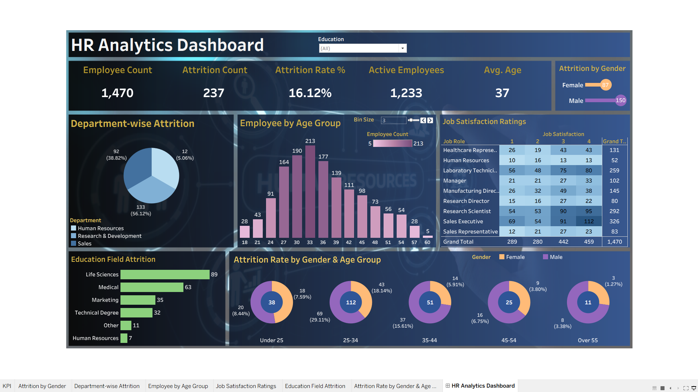
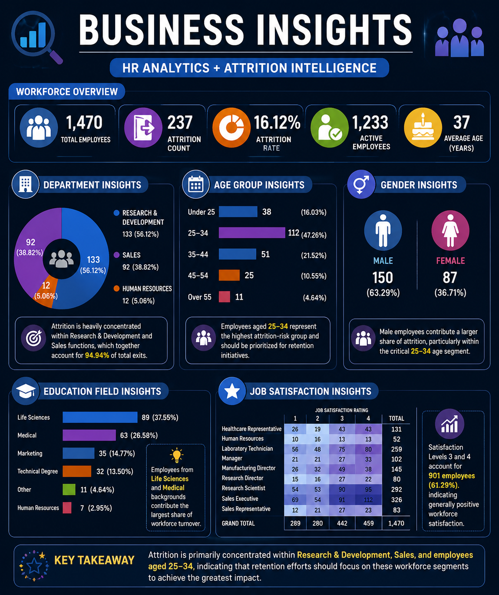
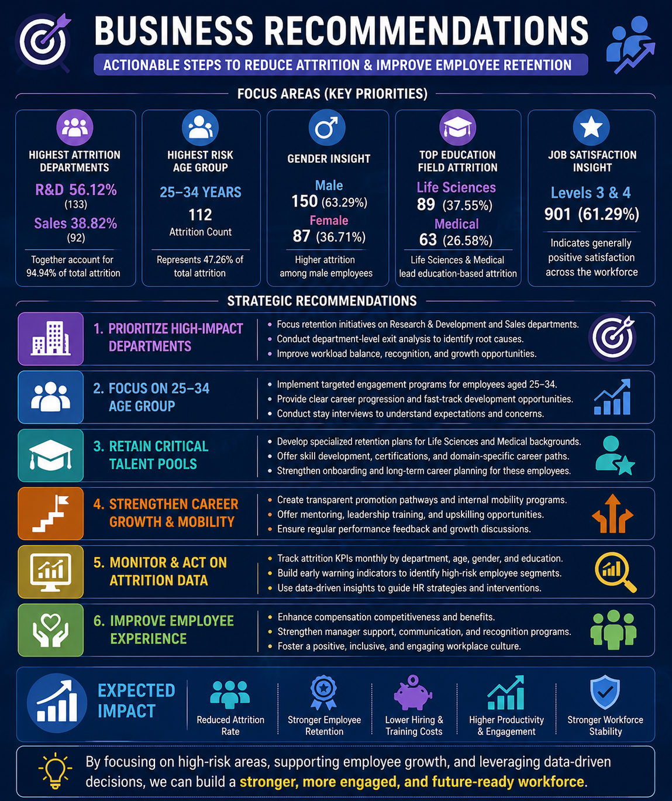

# 🚀 HR Analytics & Employee Attrition Intelligence Dashboard


---

# 📌 Project Overview

Employee attrition is one of the most significant challenges faced by organizations, directly impacting productivity, employee morale, hiring costs, and business performance.

This project analyzes employee attrition patterns using **Python, SQL, Machine Learning, and Tableau** to uncover workforce trends, identify high-risk employee segments, and provide data-driven recommendations for improving employee retention.

The solution transforms raw HR data into an interactive analytics dashboard designed to support strategic HR decision-making and workforce planning.

---

# ⭐ Project Highlights

✔ Analyzed 1,470 employee records to identify attrition patterns and workforce trends

✔ Built an end-to-end HR Analytics solution using Python, SQL, Machine Learning, and Tableau

✔ Developed an interactive Tableau dashboard featuring workforce KPIs and attrition insights

✔ Performed SQL-based business analysis using aggregations, ranking functions, and analytical queries

✔ Built a Logistic Regression model to demonstrate employee attrition prediction

✔ Delivered actionable business insights and retention recommendations

---

# 🎯 Business Problem

### How can organizations identify attrition risks and improve employee retention using data analytics?

The project focuses on:

* Understanding employee attrition behavior
* Identifying high-risk workforce segments
* Analyzing workforce demographics
* Evaluating job satisfaction patterns
* Supporting employee retention strategies
* Enabling data-driven HR decision-making

---

# 🛠️ Tools & Technologies

| Technology   | Purpose                   |
| ------------ | ------------------------- |
| Python       | Data Cleaning & Analysis  |
| Pandas       | Data Manipulation         |
| NumPy        | Numerical Computing       |
| Matplotlib   | Data Visualization        |
| Seaborn      | Exploratory Data Analysis |
| Scikit-Learn | Machine Learning          |
| MySQL        | Business Analysis         |
| Tableau      | Dashboard Development     |
| GitHub       | Portfolio Documentation   |

---

# 📊 Dashboard Preview



---

# 📓 Analysis Notebooks

The project includes both Jupyter Notebooks and HTML exports for improved accessibility.

### Data Cleaning

* notebooks/01_data_cleaning.ipynb
* notebooks/01_data_cleaning.html

### Exploratory Data Analysis

* notebooks/02_exploratory_data_analysis.ipynb
* notebooks/02_exploratory_data_analysis.html

### Attrition Prediction

* notebooks/03_attrition_prediction.ipynb
* notebooks/03_attrition_prediction.html

> HTML exports are included to ensure a smooth viewing experience even when GitHub notebook previews are unavailable.

---

# 📈 Key Performance Indicators

| KPI                  | Value    |
| -------------------- | -------- |
| Total Employees      | 1,470    |
| Attrition Count      | 237      |
| Attrition Rate       | 16.12%   |
| Active Employees     | 1,233    |
| Average Employee Age | 37 Years |

---

# 🔍 Dashboard Analytics

## Workforce Overview

* Employee Count Monitoring
* Active Workforce Analysis
* Attrition Tracking

## Employee Demographics

* Age Group Analysis
* Gender Distribution
* Education Background Analysis

## Attrition Analysis

* Department-wise Attrition
* Gender-wise Attrition
* Age Group Attrition
* Education Field Attrition

## Employee Satisfaction

* Job Satisfaction Heatmap
* Workforce Satisfaction Trends

---

# 💡 Business Insights



---

# 🎯 Business Recommendations



---

# 🧠 Machine Learning Component

A Logistic Regression model was developed to demonstrate employee attrition prediction.

### Model Workflow

```text
HR Dataset
      ↓
Data Cleaning
      ↓
Feature Engineering
      ↓
Label Encoding
      ↓
Train-Test Split
      ↓
Logistic Regression
      ↓
Employee Attrition Prediction
```

The model demonstrates how predictive analytics can assist HR teams in proactively identifying employees at risk of leaving the organization.

---

# 🗄️ SQL Business Analysis

The SQL phase of the project was used to answer workforce-related business questions and generate actionable HR insights.

### Techniques Used

* Aggregations
* CASE Statements
* GROUP BY Analysis
* Ranking Functions
* Workforce Segmentation
* Attrition Analysis Queries

### Business Questions Answered

* Which departments experience the highest attrition?
* Which age groups are most likely to leave?
* How does attrition vary across genders?
* Which education fields contribute most to attrition?
* What workforce satisfaction patterns exist?

---

# 📂 Project Structure

```bash
02-HR-Analytics-Attrition-Project/

├── data/
├── notebooks/
│   ├── 01_data_cleaning.ipynb
│   ├── 02_exploratory_data_analysis.ipynb
│   ├── 03_attrition_prediction.ipynb
│   ├── 01_data_cleaning.html
│   ├── 02_exploratory_data_analysis.html
│   └── 03_attrition_prediction.html
│
├── sql_queries/
├── tableau_dashboard/
│   └── screenshots/
│       └── hr_dashboard.png
│
├── reports/
│   ├── Executive_Summary.md
│   ├── Business_Insights.png
│   └── Business_Recommendations.png
│
├── README.md
└── requirements.txt
```

---

# 🔄 Analytics Workflow

```text
Raw HR Dataset
        ↓
Python Data Cleaning
        ↓
Exploratory Data Analysis
        ↓
Machine Learning Prediction
        ↓
SQL Business Analysis
        ↓
Interactive Tableau Dashboard
        ↓
Business Insights & Recommendations
```

---

# 🎯 Key Findings

✅ Overall Attrition Rate: 16.12%

✅ Research & Development recorded the highest employee attrition

✅ Employees aged 25–34 represented the highest attrition-risk segment

✅ Male employees accounted for a larger share of workforce exits

✅ Life Sciences recorded the highest education-based attrition

✅ Most employees reported moderate to high job satisfaction levels

---

# 🏆 Skills Demonstrated

* Data Analysis
* HR Analytics
* Workforce Intelligence
* SQL Querying
* Machine Learning
* Data Visualization
* Dashboard Development
* Business Reporting
* Predictive Analytics
* Storytelling with Data

---

# 🚀 Business Impact

This solution enables HR teams to:

* Monitor employee attrition trends
* Identify high-risk workforce segments
* Improve employee retention strategies
* Support workforce planning decisions
* Track workforce KPIs through interactive dashboards
* Transform HR data into actionable business intelligence

The project demonstrates the complete analytics lifecycle from raw data preparation to executive-level reporting and interactive dashboard development.
